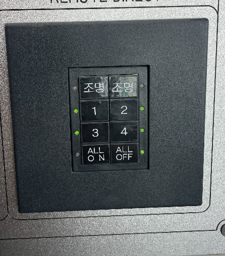
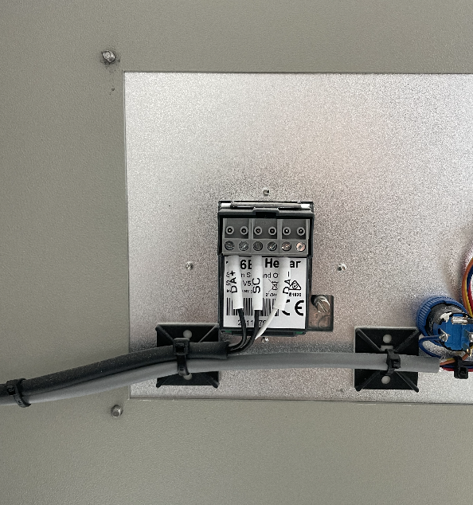
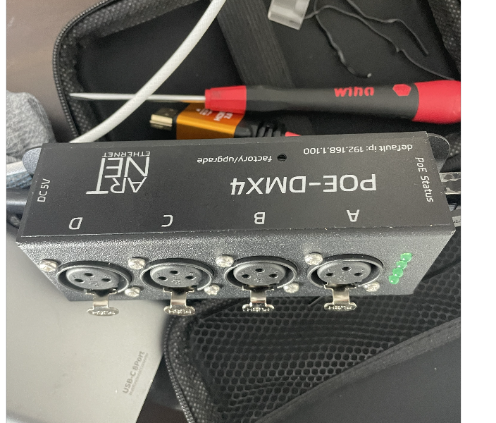

조명제어 프러그램 만들기 (실리카에서 바이너리 형식으로 처리)

a,b 조명 on/off 제어를 프로그램화 할꺼야

중간 제어용 장비로는 artnet poe-dmx4를 활용 할 예정입니다.

총 2군데의 조명을 제어를 하려고 하고  dmx 장비의 각각 a,b로 터미널에 연결해서 프로그램을 설계 하려해

현재 a 부분 만 연결하니 웹서버에 설정 부분이 있어 

장비의 ip는 192.168.1.100 

관련사진은 아래와 같아

<!-- Obsidian 방식 (가로 400px) -->

![[1767835745129.png|100]]

`<!-- 표준 HTML 방식 (가로 400px) -->`

``
